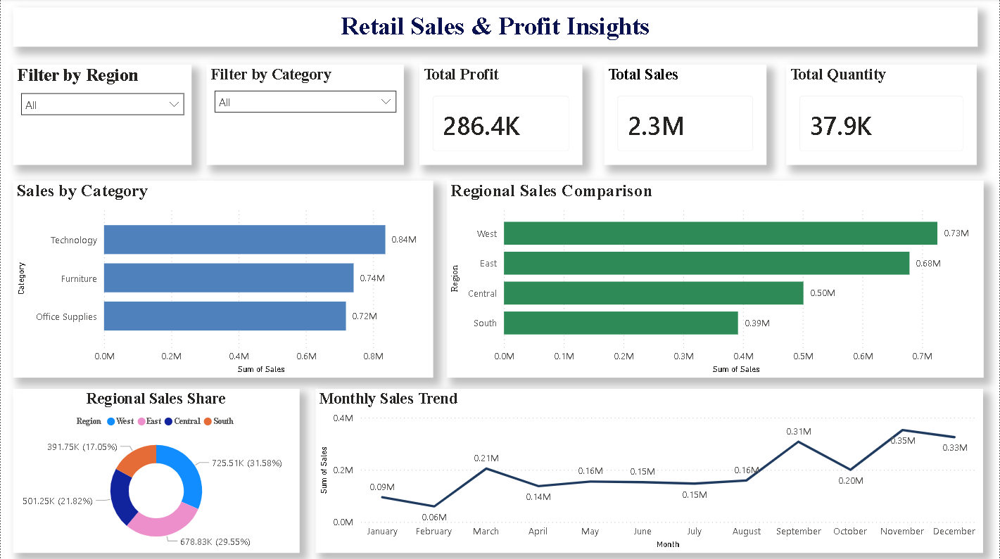

# Retail Sales & Profit Insights Dashboard

Interactive Power BI dashboard designed to analyze retail sales performance, regional trends, category-wise insights, and key business KPIs.

---

## Dashboard Preview

---

## Project Overview

This project focuses on analyzing retail sales data using Power BI to identify regional trends, category performance, monthly sales patterns, and key business KPIs through interactive visualizations.

---

## Tools & Technologies Used

- Power BI
- DAX
- Data Visualization
- Kaggle Dataset

---

## Key Insights

- West region generated the highest sales performance.
- Technology category achieved the highest revenue contribution.
- Sales trends showed significant growth toward year-end.
- Interactive filters improved data exploration and analysis.

---

## Features

- Interactive KPI cards
- Dynamic slicers and filters
- Monthly sales trend analysis
- Regional sales comparison
- Category-wise sales visualization
- Clean and professional dashboard design

---

## Business Outcome

The dashboard helps businesses monitor sales performance, identify high-performing regions and categories, and support data-driven decision-making using visual analytics.

---

## Skills Demonstrated

## Skills Demonstrated

- Dashboard Design
- KPI Visualization
- Data Analysis
- Interactive Reporting
- Data Storytelling
- Power BI Visualization
